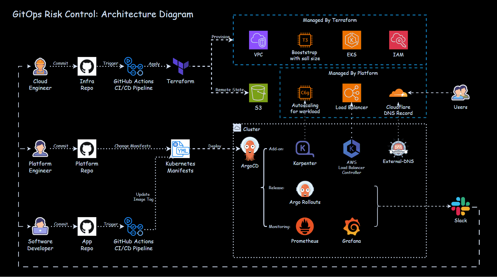
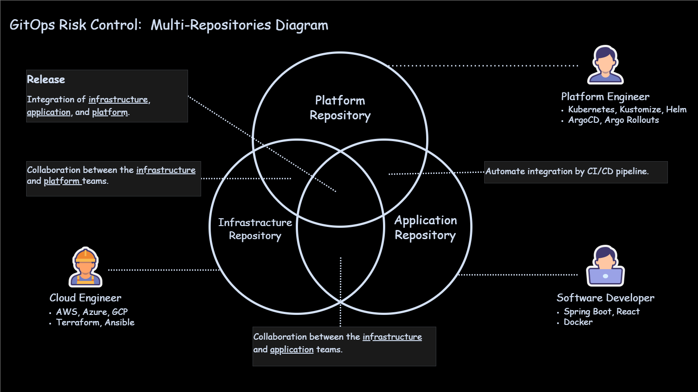
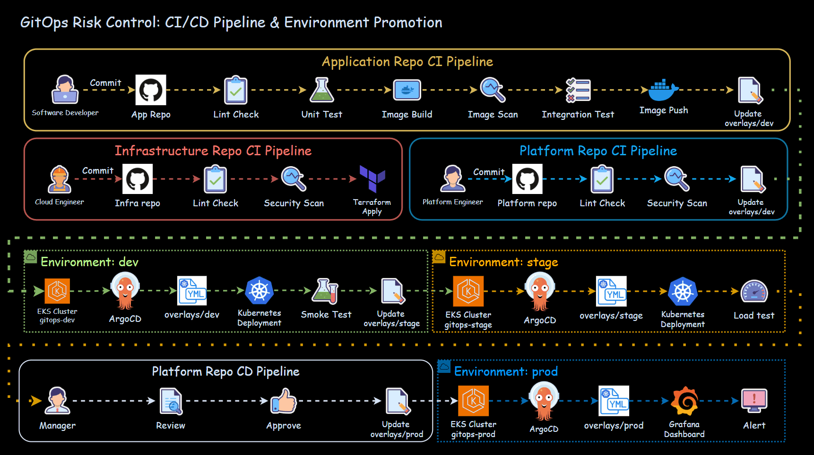
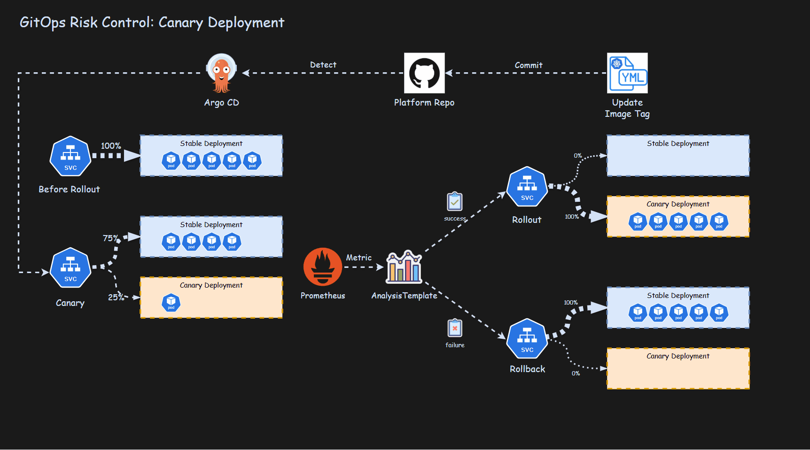
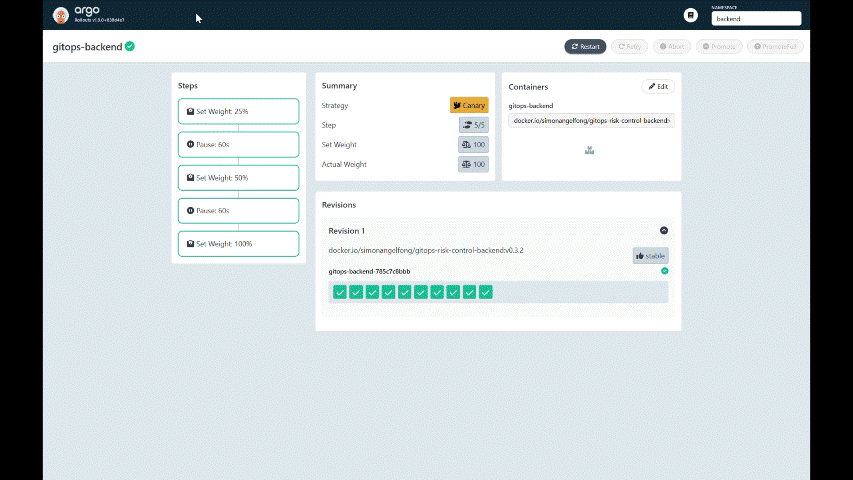
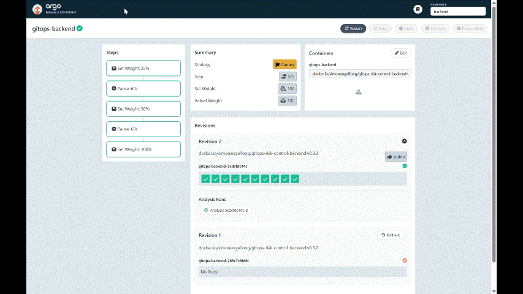

# GitOps Risk Control

**Validate Early. Release Gradually. Detect Fast.**

> A production-style GitOps project that reduces release risk across the delivery lifecycle.
> It validates changes through `multi-repo` and `multi-environment promotion`, releases gradually with `canary deployment`, and detects post-release issues through **monitoring** and **alerting**.

         
         

- [GitOps Risk Control](#gitops-risk-control)
  - [Challenge and Solution](#challenge-and-solution)
  - [Pre-release Risk Control](#pre-release-risk-control)
    - [Multi-Repositories](#multi-repositories)
    - [Environment Strategy](#environment-strategy)
    - [Automated Promotion Pipeline](#automated-promotion-pipeline)
  - [Release Risk Control](#release-risk-control)
    - [Canary Demo: Happy Path Promotion](#canary-demo-happy-path-promotion)
    - [Canary Demo: Failure Rollback](#canary-demo-failure-rollback)
  - [Post-release Risk Control](#post-release-risk-control)
    - [OOM Incident Simulation](#oom-incident-simulation)
  - [Summary](#summary)

---

## Challenge and Solution

**Challenge:**

Every production release carries the risk of introducing **bugs that affect users and disrupt business operations**.  
How can changes be **validated early**, **released gradually**, and **monitored continuously** to reduce business impact?

**Solution:**

This project implements a **GitOps-based release risk control workflow** across three phases:

| Phase        | Project Approach                                                                                           | Goal                                              |
| ------------ | ---------------------------------------------------------------------------------------------------------- | ------------------------------------------------- |
| Pre-release  | Separate responsibilities with dedicated repositories and isolated `dev`, `stage`, and `prod` environments | Catch issues early before they reach production   |
| Release      | Use `canary deployment` and automated rollout control                                                      | Limit the impact of failed releases               |
| Post-release | Monitor system health and trigger alerts after deployment                                                  | Detect incidents quickly and reduce recovery time |

---

- **Architecture Diagram**

---

## Pre-release Risk Control

`Pre-release risk control` focuses on reducing coordination issues, catching problems early, and preventing unvalidated changes from reaching production.

### Multi-Repositories

- Multi-repo practice creates clear **ownership boundaries**, reduces **coordination risk**, and makes changes **easier to review and audit**.
- The project separates **application**, **infrastructure**, and **platform** responsibilities into dedicated repositories.

| Repository                                                                                      | Role                | Main Responsibility                                                                                                |
| ----------------------------------------------------------------------------------------------- | ------------------- | ------------------------------------------------------------------------------------------------------------------ |
| [Platform](https://github.com/simonangel-fong/Project_GitOps_Risk_Control_Platform_Repo.git)    | _Platform Engineer_ | Kubernetes add-ons, application manifests, sync waves, canary rollout configuration, monitoring, and notifications |
| [Application](https://github.com/simonangel-fong/Project_GitOps_Risk_Control_App_Repo.git)      | _Software Engineer_ | Application source code, Docker image build, image push, and deployment update trigger                             |
| [Infrastructure](https://github.com/simonangel-fong/Project_GitOps_Risk_Control_Infra_Repo.git) | _Cloud Engineer_    | AWS infrastructure, EKS clusters, Argo CD installation, and networking foundation                                  |

---

### Environment Strategy

- `Isolated environments` **control blast radius** through a git branching strategy, separate clusters, manifests, and DNS endpoints.
- The project separates `dev`, `stage`, and `prod` environments using dedicated `Git branches`, `EKS clusters`, and `Kustomize` overlay manifests.

| Environment     | `dev`                                    | `stage`                                   | `prod`                                 |
| --------------- | ---------------------------------------- | ----------------------------------------- | -------------------------------------- |
| Branch          | `dev`                                    | `stage`                                   | `prod`                                 |
| Cluster         | `gitops-dev`                             | `gitops-stage`                            | `gitops-prod`                          |
| Manifest Path   | `overlays/dev/`                          | `overlays/stage/`                         | `overlays/prod/`                       |
| DNS Endpoint    | `https://gitops-dev.domain`              | `https://gitops-stage.domain`             | `https://gitops.domain`                |
| Purpose         | Early validation for development changes | Production-like validation before release | Live environment for end users         |
| Characteristics | Fast-changing and flexible               | Test-heavy and production-like            | Stable, reliable, and security-focused |

---

### Automated Promotion Pipeline

- The `CI/CD pipeline` connects the separated **repositories** and **environments** into one controlled delivery flow.
- It validates changes, promotes manifests across environments, and keeps production promotion approval-based.

| Environment | Owner & Trigger                                           | Pipeline Responsibility                                                                                        |
| ----------- | --------------------------------------------------------- | -------------------------------------------------------------------------------------------------------------- |
| `dev`       | _Platform Engineer_ commits manifest changes              | Run manifest validation, security checks, GitOps sync, smoke test, and failure notification                    |
| `stage`     | Auto-promotion after successful dev validation            | Promote manifests to stage, run GitOps sync, execute load test, and send validation result                     |
| `prod`      | _Release Owner_ reviews and approves production promotion | Promote manifests to prod, run GitOps sync, send release notification, and hand off to post-release monitoring |

- The pipeline keeps `dev` and `stage` highly automated for fast validation.
- The `prod` environment requires **human release approval** to protect production stability.

---

## Release Risk Control

- `Release risk control` focuses on limiting production impact when a new version reaches users.
- Instead of replacing the stable version all at once, the project uses `canary deployment`, automated rollout analysis, and GitOps-based recovery to release changes gradually and safely:
  - **Canary Deployment**: shifts a small portion of production traffic to the new version before full rollout.
  - **Automated Rollout Analysis**: evaluates rollout health before increasing traffic.
  - **Rollback/Revert Strategy**: stops unsafe releases and restores the stable version through GitOps-based recovery.

---

### Canary Demo: Happy Path Promotion

A new version passes rollout analysis, traffic is gradually promoted, and `Slack` receives the deployment result.

---

### Canary Demo: Failure Rollback

A bad release fails health or metric validation, `Argo Rollouts` rolls back to the stable version, and `Slack` receives the rollback notification.

---

## Post-release Risk Control

`Post-release risk control` focuses on detecting production issues quickly after deployment.
Monitoring dashboards and incident alerts help identify abnormal behavior and support faster recovery.

- `Grafana dashboards`: **visualize** application and cluster health after deployment

  

- `Alertmanager`: **notify** operators when abnormal conditions occur

  

---

### OOM Incident Simulation

- Demo triggers a controlled post-release memory issue to demonstrate alerting, dashboard visibility, log investigation, and recovery behavior.

---

## Summary

| Phase        | Risk                           | Mitigation                    | Description                                       |
| ------------ | ------------------------------ | ----------------------------- | ------------------------------------------------- |
| Pre-release  | Coordination risk across roles | Multi-repos                   | Separates responsibilities with clearer ownership |
| Pre-release  | Production-readiness risk      | Environment isolation         | Isolates `dev`,`stage`,`prod` environments        |
| Pre-release  | Bug/security risk              | CI/CD across repos & env      | Catches issues before promotion                   |
| Release      | Rollout risk                   | Canary deployment             | Limits blast radius of failed releases            |
| Release      | Manual response risk           | Automated analysis / rollback | Stops unhealthy rollout faster                    |
| Post-release | Visibility risk                | Prometheus/Grafana monitoring | Shows system health after deployment              |
| Post-release | Operation risk                 | Alertmanager alerts           | Helps identify incidents sooner and reduce MTTR   |
